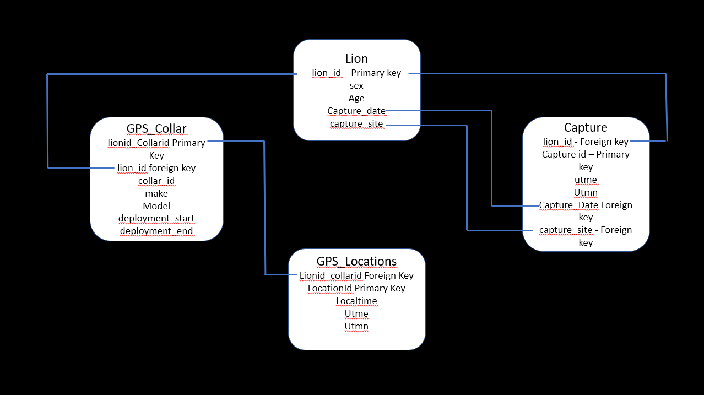

--- 
title: "Reproducible Science Final Project"
author: "John Randolph"
date: "`r Sys.Date()`"
site: bookdown::bookdown_site
documentclass: book
bibliography: [book.bib, packages.bib]
# url: your book url like https://bookdown.org/yihui/bookdown
# cover-image: path to the social sharing image like images/cover.jpg
description: |
  This is a web page created for the final project during the Reproducible Science Course in 2023
link-citations: yes
github-repo: rstudio/bookdown-demo
---

# About

This website is created to display and walk through the GPS cleaning process for collared mountain lion data. 

<!--chapter:end:index.Rmd-->

# Creating a database

Below I display how to create a database for my final project in reproducible data science for 2023. 
Provided is an example databse that we will be creating.

```{r, echo=FALSE}

```

Load all packages needed to create the database

```{r, eval=FALSE}
library(DBI)
```

## Establish the connection with database
library(DBI)
Here we will establish the connection for the database to the directory using `dbconnect`

```{r, eval=FALSE}
Thesis_database <- dbConnect(RSQLite::SQLite(), 
                        "C:/Users/jaran/Desktop/R/Spr22Classwork/Reproducible Science/Final_Project/SQL_database/Thesis_Database.db")

class(Thesis_database)
```

## Creating Tables

Below I will create a table using the `dbexecute` function. Within this function I will then use SQL language to create tables for my database.

```{r, eval=FALSE}
dbExecute(Thesis_database, "CREATE TABLE Lion (
                                                lion_id varchar(6) NOT NULL,
                                                sex char(1) CHECK (sex IN ('M', 'F')),
                                                age char(2),
                                                capture_date text,
                                                capture_site varchar(25),
                                                PRIMARY KEY (lion_id));")

dbExecute(Thesis_database, "CREATE TABLE Capture (
                                                lion_id varchar(6) NOT NULL,
                                                capture_id char(4),
                                                capture_site varchar(25),
                                                capture_date text,
                                                utm_x  float,
                                                utm_y  float,
                                                PRIMARY KEY (capture_id)
                                                FOREIGN KEY (capture_site) REFERENCES Lion(capture_site)
                                                FOREIGN KEY (lion_id) REFERENCES Lion(lion_id)
                                                FOREIGN KEY (capture_date) REFERENCES Lion(capture_date)
                                                );")

dbExecute(Thesis_database, "CREATE TABLE GPS_Collar (
                                                     lion_id varchar(6) NOT NULL,
                                                    lionid_collarid varchar(25)),
                                                     collar_id varchar(10),
                                                     make varchar(25),
                                                     model varchar(25),
                                                     deployment_start text,
                                                     deploymeny_end text,
                                                     PRIMARY KEY (lionid_collarid)
                                                     FOREIGN KEY (lion_id) REFERENCES Lion(lion_id)
                                                     );")

dbExecute(Thesis_database, "CREATE TABLE GPS_Locaton (
                                                     locationid varchar(20) NOT NULL,
                                                    lionid_collarid varchar(25),
                                                     collar_id varchar(10),
                                                     localtime text,
                                                     utme_x float,
                                                     utmn_y float,
                                                     PRIMARY KEY (locationid)
                                                     FOREIGN KEY (lionid_collarid) REFERENCES

```


<!--chapter:end:01-intro.Rmd-->

# Processing Raw Data

Load all packages needed to begin processing data.

```{r, eval==FALSE}

library(tidyverse)
library(magrittr)
library(dplyr)
library(purrr)
library(lubridate)
library(amt)
library(elevatr)
library(sf)
library(sp)

```

Next we will read the raw data in for one individual. The code is also piped to change all upper case to lower and to remove spaces

```{r, eval=FALSE}

Lion <- read_csv("C:/Users/jaran/Desktop/USU_Thesis_Project/Raw_Data/IWS_Lions/FromDave/M280_GPS_Collar31756_20230112141501.csv", locale=locale(encoding="latin1")) %>% 
  rename_with(~ tolower(gsub("[[:punct:]]", "", .))) %>% 
  rename_with(~gsub(" ", "",  .))

```

Here we selected columns to work with and removed all NA's in latitude and longitude. Here, I also shift my utctime to character so I can later convert it to GMT


```{r, eval=FALSE}

Lion %<>%
  select(no, collarid, utcdate, utctime, latitude, longitude, dop, fixtype) %>%
  filter(is.na(latitude) == F | is.na(longitude) == F) %>%
  mutate(utctime = as.character(utctime))

```


Here we will paste the utcdate and utctime together and convert it into GMT time then remove the old utcdate and utctime columns

```{r, eval=FALSE}

Lion %<>% 
  mutate(GMT = as.POSIXct(paste(utcdate, utctime, sep = " "), 
                          tryFormats = c("%m/%d/%Y %I:%M:%S %p",              
                                         "%m/%d/%y %H:%M:%S", 
                                         "%m/%d/%Y %H:%M:%S"), tz="GMT")) %>%  
  select(-c(utcdate, utctime))    

```


Next we will convert the GMT time to localetime for the timezone this lion was collared in(Pacific). We convert and then lock the local time to GMT. Once complted we remove the column GMT. 

```{r, eval=FALSE}

Lion %<>% 
  mutate(localtime = with_tz(GMT, tz = "Etc/GMT+8")) %>% 
  mutate(localtime = force_tz(localtime, tzone = "GMT")) %>%
  select(-c(GMT))


```


Below I now filter the time the collar was on the mountain lion. I set this up to begin one day after collaring and end one day before the collar drop off mechanism is triggered. In this case the lion was collared on 11/17/2018 and the collar dropped on on 6/29/2022.

```{r, eval=FALSE}

Lion %<>% filter(localtime >= "2021/11/18" & localtime <= "2022/6/28")

```

Now we will access the satellite dop ratings for each GPS point to filter thrown points. For my project we decided to remove any dop that is higher than 6. 

```{r}

Lion$dop
max(Lion$dop)

Lion %<>% filter(dop <= 6)

```

The last part of processing is to convert the latitude and longitude to utme and utmn. Below I transformed longitude and latitude to a simple feature spatial object and then to UTMs in WGS84.

```{r}

Lion %<>%
  st_as_sf(coords = c("longitude", "latitude"), crs = 4326, na.fail = FALSE, remove = FALSE) %>% # transform to simple feature spatial object
  st_transform(32610) %>% # transform to utms in WGS84
  mutate(utme = unlist(map(geometry, 1)), utmn = unlist(map(geometry, 2)))

```

Finally inspect data that all conversions and filtering is correct and export the processed data to its new folder.

```{r}
names(Lion)
head(Lion)
summary(Lion$latitude) 

M280 <- saveRDS(Lion, "C:/Users/jaran/Desktop/USU_Thesis_Project/Cleaned_Data/ProcessedData/California/M280.rds")
M280 <- write.csv(Lion, file="C:/Users/jaran/Desktop/USU_Thesis_Project/Cleaned_Data/ProcessedData/California/M280.csv")


```


<!--chapter:end:02-Data-Processing.Rmd-->

#  Data Resampling

Load all packages needed to begin resampling.

```{r, eval==FALSE}

library(tidyverse)
library(magrittr)
library(dplyr)
library(purrr)
library(lubridate)
library(amt)
library(elevatr)
library(sf)
library(sp)

```

Next we will read the processed data in for one individual and inspect data

```{r, eval=FALSE}

lion <- readRDS("C:/Users/jaran/Desktop/USU_Thesis_Project/Cleaned_Data/ProcessedData/California/Dop6/M280.rds")

head(lion)

```

Now we will transform the processed data into a track to begin our resampling process. 


```{r, eval=FALSE}

trk <- lion %>% mk_track(.x = utme, 
                         .y = utmn, 
                         .t = localtime, 
                         id = collarid,
                         crs = "+proj=utm +zone=10 +datum=WGS84 +units=m +no_defs",
                         all_cols = TRUE)


```


Next we will use `track resample` to convert our localtime to down sample to 4 hour points with 10 minute tolerance. 

```{r, eval=FALSE}

trk %<>% track_resample(rate = hours(4), tolerance = minutes(10)) %>% 
  time_of_day(include.crepuscule = TRUE)

```

Last we will check to see if the data was resampled propoerly then extract the data out of the track and into a new object.


```{r}

head(trk)

lion <- trk %>% select(no, collarid, latitude, longitude, localtime = t_, utme = x_, utmn = y_, dop, fixtype, geometry )

head(lion)

```

Export data into a new folder to organize different resampled data. 

```{r}

M280 <- saveRDS(lion, "C:/Users/jaran/Desktop/USU_Thesis_Project/Cleaned_Data/ProcessedData/ResampledData/California/4hrs/M280.rds")
M280 <- write.csv(lion, file="C:/Users/jaran/Desktop/USU_Thesis_Project/Cleaned_Data/ProcessedData/ResampledData/California/4hrs/M280.csv", row.names = F)


```


<!--chapter:end:03-Data-Resampling.Rmd-->

#  Cluster Identifiation

Load all packages needed to begin and source material. This code was created by Peter Mahoney and can be found at https://github.com/PMahoney29/rAnimalSiteFidelity 

```{r, eval==FALSE}

library(bcpa)
library(rgdal)
library(rgeos)
library(maptools)
library(foreach)
library(doParallel)
library(lubridate)
library(ggplot2)
library(dplyr)
library(raster)

source("./Code/rASF.R")

```

Next we will read the resampled data in for one individual and convert the localtime to a specific format of mdy_hm. Next I removed duplicates from the data. 

```{r, eval=FALSE}

d <- read.csv("C:/Users/jaran/Desktop/USU_Thesis_Project/Cleaned_Data/ProcessedData/ResampledData/California/4hrs/M280.csv")
d$dt <- mdy_hm(d$localtime, tz = 'GMT')
d <- d[!duplicated(d$dt),]
coordinates(d) <- d[, c('longitude', 'latitude')]
proj4string(d) <- CRS('+proj=longlat +datum=WGS84')


```

Now we will be sure to project for accurate measurements and note the zone of which the collared individual was collared.


```{r, eval=FALSE}

utmProj = CRS("+proj=utm +zone=10 +datum=WGS84")
d <- spTransform(d, utmProj)
str(d)


```


Now running a function from the pulled github package to assign all data in a specific order.

```{r, eval=FALSE}

clustxy <- ClusterXY(xy = coordinates(d), dt = d$dt, 
                     proj4string = utmProj, id = '31756', 
                     PointID = 'no', Data = d@data)

```

Next we assign the parameters to the cluster identifier. nfixes is the total number of points in the location to be considered a cluster. sbuffer is the radius around the cluster that points can be found in. tbuffer is the amount of time that has to past without a new point at the cluster for the cluster to end. intime, inPar, and nCores allow for smoother running of the identifier code. 

```{r}

nfixes = 4
sbuffer = 150
tbuffer = 24
intime = T

inPar = TRUE
nCores = detectCores() - 1

```

Run code below to identify clusters with parameters above.

```{r}

M280_clusters <- visualize_clusters(clustxy, nfixes, sbuffer, tbuffer, intime,
                                    inPar = inPar, nCores = nCores)

summary(M280_clusters)

```

Below I created a for loop to extract all the points in each cluster that was identified but leave the first and last one out. THis will allow me to have a starting and or end point for running an iSSA.


```{r}

temp <- M280_clusters@Data[[1]]
first <- nrow(temp)
last <- 1
toremove <- temp[-c(first,last),]

# Forloop for rest of the dataset

for (i in 2:length(M280_clusters@Data)){
  temp <- M280_clusters@Data[[i]]
  first <- nrow(temp)
  last <- 1
  tempnew <- temp[-c(first,last),]
  toremove <- rbind(toremove, tempnew)
}

```

Lastly export all points that are provided from the for loop above. 

```{r}

M280 <- saveRDS(toremove, "C:/Users/jaran/Desktop/USU_Thesis_Project/Cleaned_Data/ProcessedData/ClustersforRemoval/M280ClusterRemoval.rds")
M280 <- write.csv(toremove, file="C:/Users/jaran/Desktop/USU_Thesis_Project/Cleaned_Data/ProcessedData/ClustersforRemoval/M280ClusterRemoval.csv", row.names = F)

```


<!--chapter:end:04-Cluster-Identifier.Rmd-->

#  Data Resampling

Load all packages needed to remove clusters.

```{r, eval==FALSE}

library(dplyr)
library(magrittr)


```

Next we will read the ressampled data and the cluster identified data in for one individual and inspect data

```{r, eval=FALSE}

ProssData <- read.csv("C:/Users/jaran/Desktop/USU_Thesis_Project/Cleaned_Data/ProcessedData/ResampledData/California/4hrs/M280.csv")

RemoveClust <- read.csv("C:/Users/jaran/Desktop/USU_Thesis_Project/Cleaned_Data/ProcessedData/ClustersforRemoval/California/M280ClusterRemoval.csv")

```

Next we will select PointID in the RemoveClust and change it to no so that both files have an identical column. 


```{r, eval=FALSE}

RemoveClust <- RemoveClust %>% dplyr::select(no = "PointID")

```


Lastly, we will `anti_join the ProssData and RemoveClust by the no column to remove all cluster points from our data.

```{r, eval=FALSE}

CleanedData <- anti_join(ProssData, RemoveClust, by = "no")
```

Finally export all data into a new folder called cleaned data and begin your analysis!!!!

```{r}

M280 <- saveRDS(CleanedData, "C:/Users/jaran/Desktop/USU_Thesis_Project/Cleaned_Data/CleanedData/California/Dop6/M2804hrCleaned.rds")
M280 <- write.csv(CleanedData, file="C:/Users/jaran/Desktop/USU_Thesis_Project/Cleaned_Data/CleanedData/California/Dop6/M2804hrCleaned.csv", row.names = F)


```


<!--chapter:end:05-Cluster-Removal.Rmd-->

# Sharing your book

## Publishing

HTML books can be published online, see: https://bookdown.org/yihui/bookdown/publishing.html

## 404 pages

By default, users will be directed to a 404 page if they try to access a webpage that cannot be found. If you'd like to customize your 404 page instead of using the default, you may add either a `_404.Rmd` or `_404.md` file to your project root and use code and/or Markdown syntax.

## Metadata for sharing

Bookdown HTML books will provide HTML metadata for social sharing on platforms like Twitter, Facebook, and LinkedIn, using information you provide in the `index.Rmd` YAML. To setup, set the `url` for your book and the path to your `cover-image` file. Your book's `title` and `description` are also used.


This `gitbook` uses the same social sharing data across all chapters in your book- all links shared will look the same.

Specify your book's source repository on GitHub using the `edit` key under the configuration options in the `_output.yml` file, which allows users to suggest an edit by linking to a chapter's source file. 

Read more about the features of this output format here:

https://pkgs.rstudio.com/bookdown/reference/gitbook.html

Or use:

```{r eval=FALSE}
?bookdown::gitbook
```


<!--chapter:end:06-share.Rmd-->

`r if (knitr::is_html_output()) '
# References {-}
'`

<!--chapter:end:07-references.Rmd-->

